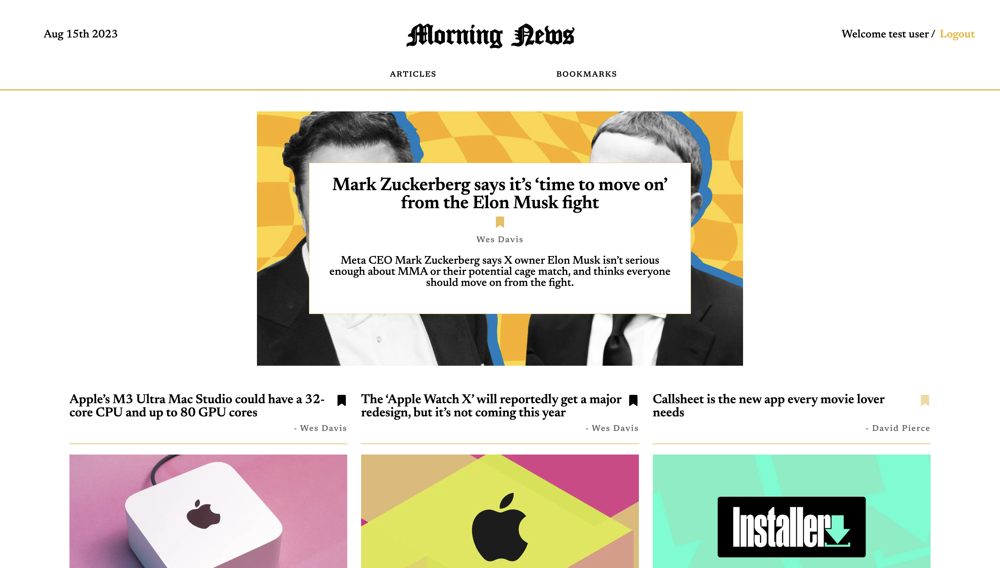

<div id="" align="center">
  
</div>

Morning News est une plateforme web sophistiquée qui vous maintient au courant des annonces et des actualités les plus récentes. Son interface intuitive vous donne accès aux dernières informations des journaux en toute fluidité. Si une annonce particulière attire votre attention, créez un compte personnel pour enregistrer vos articles préférés et les consulter ultérieurement. Restez connecté à l'actualité qui vous importe grâce à Morning News.

# Technologie utilisée

Frontend
- Javascript
- React js
- HTML
- CSS

Backend
- Node js
- Express js

### lien du site https://morning-frontend-ugd2.vercel.app/

# Prérequis pour l'installation local

- Node js
- Next js


# Installation local 

Exécutez ces lignes de commande dans votre terminal sur votre ordinateur
`````bash
git clone https://github.com/ezeflt/morning_news.git
cd morning_news/frontend
yarn install
yarn dev
`````

## Présentation de l'application web
<div id="" align="center">
  
</div>


# Développeur 

Ezechiel Felten </br>

feltenezechiel1@gmail.com</br>
[linkedin](https://www.linkedin.com/in/ezechiel-felten-475693248/)</br>
[portfolio](https://ezechiel-app.vercel.app/)</br>
